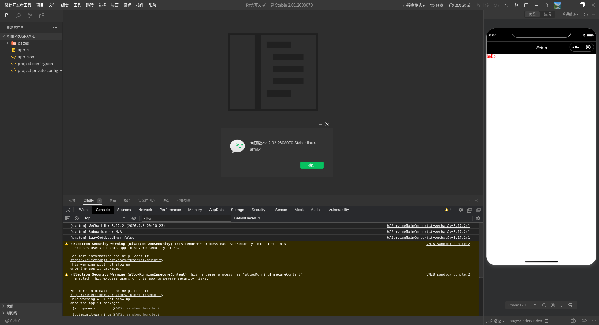
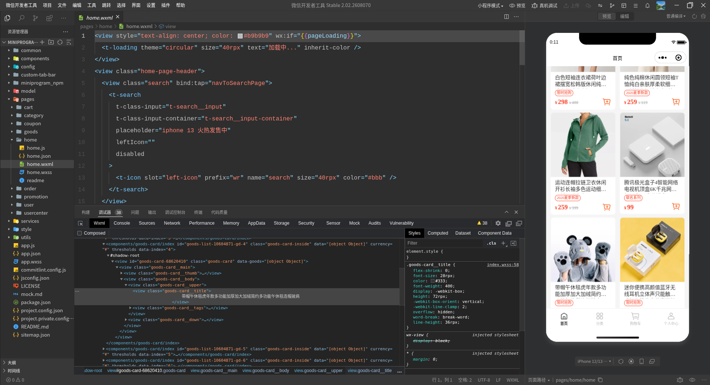
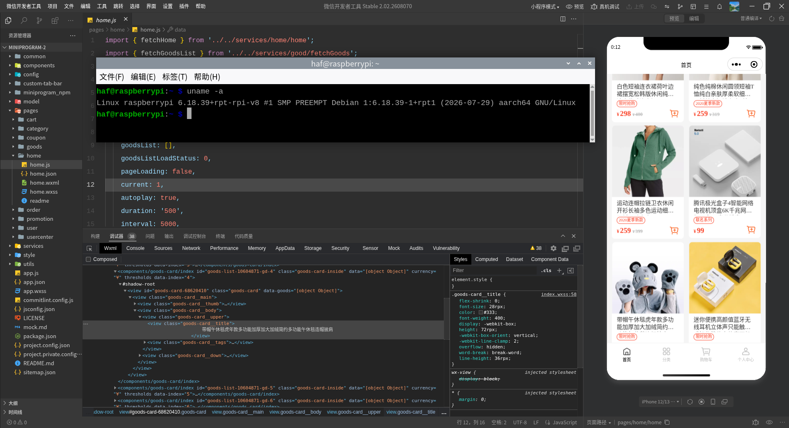
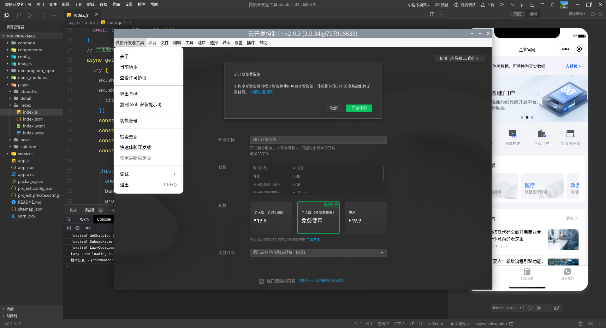

  
<div align="center">

  

  <h3>微信开发者工具 Linux arm64 版</h3>

  <br>

----

[](https://developers.weixin.qq.com/miniprogram/dev/devtools/download.html)
[](https://github.com/Little-Data/wx-compiler-arm64/actions/workflows/build-arm64.yml)
[](https://github.com/Little-Data/wx-compiler-arm64/actions/workflows/build-nightly-arm64.yml)

这是微信开发者工具 Linux arm64 版
  

  <br>
</div>

> [!Warning]
> 不建议正常生产使用，实验性构建，存在无法预见的错误！

# 项目说明

本项目是一个完整的搭建Linux下可用的“微信开发者工具”的脚本和工具集，
用于在 Linux arm64 下搭建可以持续更新和使用的“微信开发者工具”。

# 发行版日志

`stable_version_note.txt` 和 `nightly_version_note.txt` 的更新说明是直接从官方获取的，releases 中除特别说明均为官方更新日志

# 使用方法

1. 可以在本项目的[Release](https://github.com/Little-Data/wechat-web-devtools-linux/releases)中，寻找已经构筑好了的软件包，下载使用
2. 到[构建仓库](https://github.com/Little-Data/wx-compiler-arm64/actions)中下载构建好的附件

# Nightly 开发版构建

每晚同步对应的 Nightly 开发版，如果与前一次的版本相同则跳过构建。

到 [这里](https://github.com/Little-Data/wx-compiler-arm64/actions/workflows/build-nightly-arm64.yml) 查看对应开发版，选择构建时间10-20分钟左右的项目，进入后在底部 Artifacts 区域中下载 `wechat-devtools-nightly-arm64.build` 文件

**不登录下载？**

已配置 nightly.link ，进入 actions 发现 Artifacts 没有下载地址，复制该页网址（如 `https://github.com/Little-Data/wx-compiler-arm64/actions/runs/123456789`）到 https://nightly.link 粘贴，下载 `wechat-devtools-nightly-arm64.build` 文件

# 更新日志

[CHANGELOG.MD](./CHANGELOG.MD)

# 原项目地址

* https://github.com/msojocs/wechat-web-devtools-linux

# 进度

当前工具可以在Linux上构建最新版 `2.02.2608070`，支持CLI模式。
另现在已经可以直接在设置界面里面修改字体，手工输入字体名称就可以。

# 系统要求

* 基于Linux arm64 的桌面系统。
* CI自动构建的包对 glibc 和 libstdc++ 有一定的版本要求，glibc 的版本要求>=2.23，libstdc++ 的版本要求>=3.4.21
* ~~如果你下载的是 `wine` 版本，那么你需要安装有 `wine` `wine-binfmt` 支持，建议版本在5.0以上，低版本可能会存在有问题~~

# CLI支持

在项目的 `bin` 目录中有 `wechat-devtools-cli` 脚本，是微信开发者工具的命令行支持 的Linux版本。相关资料可以在[微信CLI命令行V2](https://developers.weixin.qq.com/miniprogram/dev/devtools/cli.html)上找到。

# 自行构建

使用 GitHub actions 进行构建，构建仓库位于 [wx-compiler-arm64](https://github.com/Little-Data/wx-compiler-arm64/actions)

# FAQ

## Skyline(实验性功能)

启动Server后，过一段时间，点击编译即可。

> [!Warning]
> 实验性功能，非构建问题请到 [msojocs/skyline-client-server](https://github.com/msojocs/skyline-client-server/issues) 进行反馈，本人没有 Skyline arm64 版本，谢谢。
>
> 已知问题：https://github.com/msojocs/skyline-client-server/issues

```shell
docker run -d \
    --network host \
    -e HOST_UID=$(id -u) \
    -e HOST_GID=$(id -g) \
    -v "/dev/shm:/dev/shm" \
    --name wechat_devtools_server \
    ghcr.io/msojocs/skyline-client-server:master
# 可将master替换为具体版本号
```

其它请参考: [FAQ](docs/FAQ.MD)

# 界面截图

**以下图片可能很久不更新**









# 免责声明

微信开发者工具版权归腾讯公司所有，本项目旨在交流学习之用。如有不当之处，请提交 issue 联系本人。